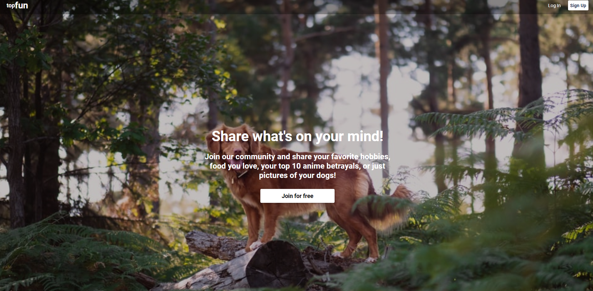
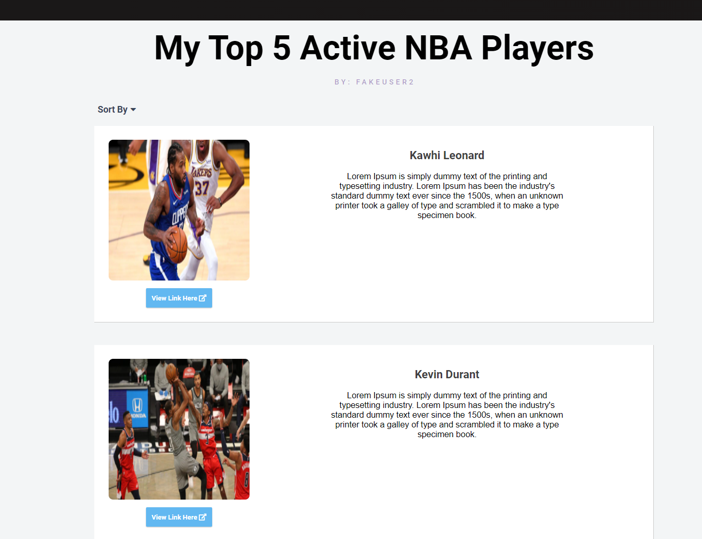
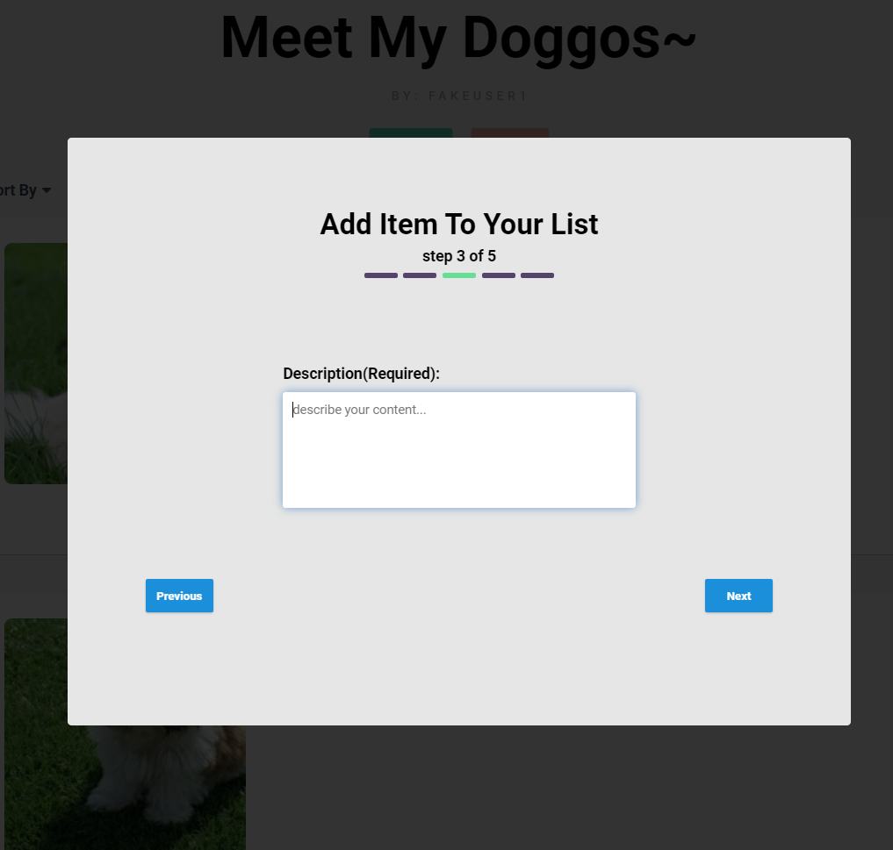

# TopFun

TopFun is a list based application where you can curate a list of your top foods, games, movies, resources, etc. and share it with others! Made with React, Express, vanilla CSS (no 3rd party components), Sequelize, PostgreSQL.

## Technologies
* <a href="https://developer.mozilla.org/en-US/docs/Web/JavaScript"></a>
* <a href="https://www.postgresql.org/"></a>
* <a href="https://sequelize.org/"></a>
* <a href="https://www.npmjs.com/package/express"></a>
* <a href="https://nodejs.org/"></a>
* <a href="https://reactjs.org/"></a>
* <a href="https://redux.js.org/"></a>
* <a href="https://developer.mozilla.org/en-US/docs/Web/CSS"></a>

## Features

### Landing Page


### List Item View


### CRUD List and List Items



## Getting started
1. Clone this repository

```javascript
git clone this repo
```

2. Install npm dependencies for both the `/frontend` and `/backend`

```javascript
cd frontend
npm install

cd backend
npm install
```

3. In the `/backend` directory, create a `.env` based on the `.env.example` with proper settings
4. Setup your PostgreSQL user, password and database and ensure it matches your `.env` file
5. Run migrations and seeds in the `/backend`

```javascript
npx dotenv sequelize db:create
npx dotenv sequelize db:migrate
npx dotenv sequelize db:seed:all
```

6. Start both the backend and frontend

```javascript
npm start
```
7. Open localhost:3000 for front end
8. Test backend API w/ localhost:5000 on postman

## Contact

### Wes Trinh
<a href="https://www.linkedin.com/in/wes-trinh-28b526220/"></a>
<a href="https://angel.co/u/wes-trinh"></a>
<a href="https://github.com/WesTrinhKL"></a>

westrinh00@gmail.com
